# LLM Query Routing Diagram (Natural Language Flow)

This diagram uses plain English to describe the logic flow of `route_query_to_function`, with color coding and text styling to highlight important steps.

```mermaid
flowchart LR
    %% Nodes
    Start([<b style="font-size:1.1em;">User submits a question</b>])
    Classify["<b style='color:#d84315;font-size:1.1em;'>Classify the question type</b><br/><i>Is it about cost, ROI,<br>design, value engineering,<br>or project data?</i><br/>(classify_question_type)"]
    Category{"<b style='color:#6d4c41;font-size:1.1em;'>What kind of question is it?</b><br/>(route_query_to_function)"}
    Benchmarks["<b>Pick the<br>'cost benchmarks' prompt</b>"]
    ROI["<b>Pick the<br>'ROI sensitivity' prompt</b>"]
    Tradeoffs["<b>Pick the<br>'cost tradeoffs' prompt</b>"]
    ValueEng["<b>Pick the<br>'cost optimizations' prompt</b>"]
    DataLookup["<b>Pick the<br>'project data inputs' prompt</b>"]
    Unknown["<b style='color:#b71c1c;'>Sorry, I can't process<br>this request.</b>"]
    RAGCheck{"<b style='color:#4527a0;'>Should I use external<br>project/material data<br>(RAG)?</b>"}
    RAG["<b>Call the RAG function</b><br/>(rag_utils.rag_call_alt)"]
    DirectLLM["<b>Call the LLM directly</b><br/>(run_llm_query)"]
    LLM["<b style='color:#4a148c;'>LLM API</b><br/>(config.client.chat.completions.create)"]
    ReturnAnswer["<b style='font-size:1.1em;'>Return the answer<br>to the user</b>"]

    %% Flow
    Start --> Classify
    Classify --> Category

    Category -->|Cost Benchmark| Benchmarks
    Category -->|ROI Analysis| ROI
    Category -->|Design-Cost Comparison| Tradeoffs
    Category -->|Value Engineering| ValueEng
    Category -->|Project Data Lookup| DataLookup
    Category -->|Other| Unknown

    Benchmarks --> RAGCheck
    ROI --> RAGCheck
    Tradeoffs --> RAGCheck
    ValueEng --> RAGCheck
    DataLookup --> RAGCheck

    RAGCheck -->|Yes| RAG
    RAGCheck -->|No| DirectLLM

    RAG --> LLM
    DirectLLM --> LLM

    LLM --> ReturnAnswer
    Unknown --> ReturnAnswer

    %% Color coding
    style Start fill:#e3f6fc,stroke:#0288d1,stroke-width:2px
    style Classify fill:#fffde7,stroke:#fbc02d,stroke-width:2px
    style Category fill:#fffde7,stroke:#fbc02d,stroke-width:2px
    style Benchmarks fill:#e8f5e9,stroke:#388e3c,stroke-width:2px
    style ROI fill:#e8f5e9,stroke:#388e3c,stroke-width:2px
    style Tradeoffs fill:#e8f5e9,stroke:#388e3c,stroke-width:2px
    style ValueEng fill:#e8f5e9,stroke:#388e3c,stroke-width:2px
    style DataLookup fill:#e8f5e9,stroke:#388e3c,stroke-width:2px
    style Unknown fill:#ffebee,stroke:#c62828,stroke-width:2px
    style RAGCheck fill:#ede7f6,stroke:#7b1fa2,stroke-width:2px
    style RAG fill:#ede7f6,stroke:#7b1fa2,stroke-width:2px
    style DirectLLM fill:#ede7f6,stroke:#7b1fa2,stroke-width:2px
    style LLM fill:#f3e5f5,stroke:#6a1b9a,stroke-width:2px
    style ReturnAnswer fill:#e3f6fc,stroke:#0288d1,stroke-width:2px
```

**Legend:**
- Blue: Start/End
- Yellow: Classification/Decision
- Green: Prompt selection
- Purple: RAG/LLM call logic
- Red: Error/Unknown

## Future Implementation: Project Data-Driven LLM Query Routing

This diagram outlines a future logic flow where the LLM acts as a natural language interface to project data (IFC, Grasshopper, etc.), supporting both direct value lookups and derived/computed queries.

```mermaid
flowchart LR
    %% Nodes
    UserQ([<b style="font-size:1.1em;">User submits a project-related question</b>])
    InterpretQ["<b style='color:#d84315;font-size:1.1em;'>Interpret the question</b><br/><i>What parameter or outcome is requested?</i>"]
    ParamType{"<b style='color:#6d4c41;font-size:1.1em;'>Is this a direct value or a derived/computed query?</b>"}
    DirectFetch["<b>Fetch value<br>from project data</b><br/>(IFC/CSV/Grasshopper)"]
    DerivedFetch["<b>Compute outcome<br>using project data</b>"]
    MapSchema["<b>Map user terms<br>to project schema</b><br/>(dictionary/schema lookup)"]
    
    ExtDataCheck{"<b style='color:#4527a0;'>Is external data (e.g., cost/unit rates) needed?</b>"}
    ExtData["<b>Retrieve external data</b><br/>(e.g., RSMeans, cost DB)"]
    WhatIfCheck{"<b style='color:#0277bd;'>Is this a 'what-if' scenario?</b>"}
    WhatIf["<b>Adjust parameter,<br>recompute outcomes</b>"]
    Compose["<b style='color:#4a148c;'>Compose answer<br>with LLM</b>"]
    ReturnA([<b style="font-size:1.1em;">Return answer to user</b>])

    %% Flow
    UserQ --> InterpretQ
    InterpretQ --> MapSchema
    MapSchema --> ParamType

    ParamType -->|Direct| DirectFetch
    ParamType -->|Derived| DerivedFetch

    DirectFetch --> ExtDataCheck
    DerivedFetch --> ExtDataCheck

    ExtDataCheck -->|Yes| ExtData
    ExtDataCheck -->|No| WhatIfCheck

    ExtData --> WhatIfCheck

    WhatIfCheck -->|Yes| WhatIf
    WhatIfCheck -->|No| Compose

    WhatIf --> Compose

    Compose --> ReturnA

    %% Color coding
    style UserQ fill:#e3f6fc,stroke:#0288d1,stroke-width:2px
    style InterpretQ fill:#fffde7,stroke:#fbc02d,stroke-width:2px
    style MapSchema fill:#fffde7,stroke:#fbc02d,stroke-width:2px
    style ParamType fill:#fffde7,stroke:#fbc02d,stroke-width:2px
    style DirectFetch fill:#e8f5e9,stroke:#388e3c,stroke-width:2px
    style DerivedFetch fill:#e8f5e9,stroke:#388e3c,stroke-width:2px
    style ExtDataCheck fill:#ede7f6,stroke:#7b1fa2,stroke-width:2px
    style ExtData fill:#ede7f6,stroke:#7b1fa2,stroke-width:2px
    style WhatIfCheck fill:#e1f5fe,stroke:#0288d1,stroke-width:2px
    style WhatIf fill:#e1f5fe,stroke:#0288d1,stroke-width:2px
    style Compose fill:#f3e5f5,stroke:#6a1b9a,stroke-width:2px
    style ReturnA fill:#e3f6fc,stroke:#0288d1,stroke-width:2px
```

