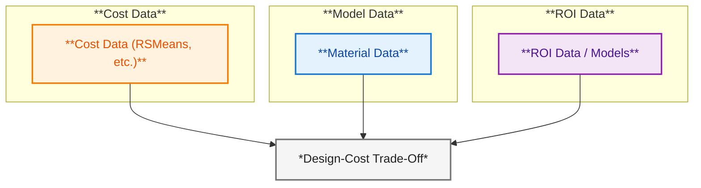
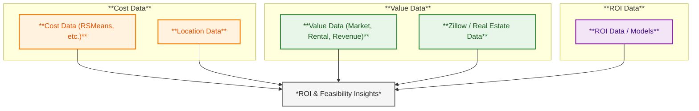
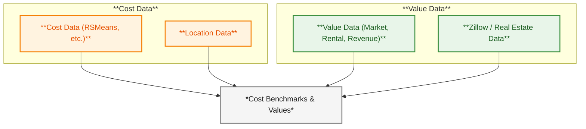
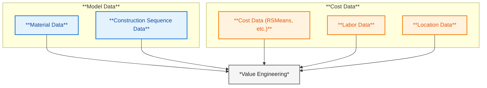
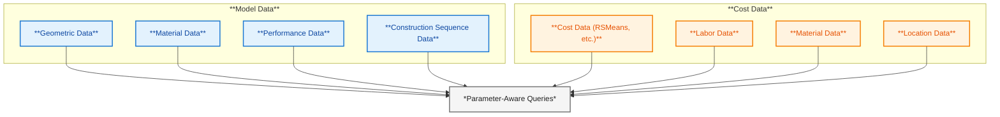
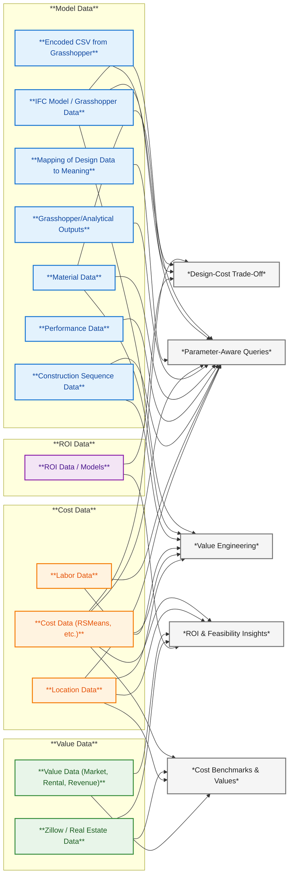

### Data Sources
- **Model Data:** The IFC model or Grasshopper data.
  - **Geometric Data:** The project’s geometry and spatial relationships.
  - **Material Data:** Information on materials used in the project.
  - **Performance Data:** Performance metrics from the model (e.g., energy use, daylighting).
  - **Construction Sequence Data:** Information on the construction sequence and phasing.
  - **Mapping of Design Data to Meaning:** A schema or dictionary to interpret terms and retrieve correct fields.

- **Cost Data:** Construction and material costs from RSMeans or similar.
  - **Labor Data:** Labor costs for work performed.
  - **Material Data:** Information on materials used in the project.
  - **Location Data:** For adjusting costs to the project’s location.

- **Value Data:** Market value data for the project.
  - **Market Data:** Real estate data from Zillow or similar sources.
  - **Rental Data:** Rental rates for the project’s location.
  - **Revenue Data:** Revenue for project programs.

- **ROI Data:** Data on return on investment.
  - **Financial Data:** Financial assumptions for the project.
  - **Investment Data:** Data on the project’s investment.
  - **ROI Models:** Models for calculating ROI.

## Design-Cost Trade-Off Prompt

These questions ask how different design choices impact cost, seeking an analysis of trade-offs.

### Handling Logic

- The system identifies key design parameters or options mentioned and relates them to cost implications.
- Compares alternatives (e.g., material A vs B, or Option 1 vs Option 2), explaining both cost differences and design consequences.
- The LLM acts as a design-cost analyst, weighing pros and cons.
- Only known cost data is used for accuracy, and reasoned explanations are provided.

### Required Data

- **Cost Data:** Construction and material costs from RSMeans or similar.
- **Model Data:** The IFC model or Grasshopper data.
-- **Material Data:** Information on materials used in the project.

- **ROI Data:** Data on return on investment.
-- **ROI Models:** Models for calculating ROI.

### Parsing & Data Handling

- **Identify Keywords/Parameters:** Recognize terms like floors, facade, foundation, steel vs concrete, etc.
- **Map to Data:** Link these terms to data sources.
- **Fetch Current Design Metrics:** If the question references the current design, retrieve that value from the Grasshopper/IFC data.
- **Comparison/Computation:** Compute the cost difference or percentage change through simple math, which can be handled by Python.

---

## ROI & Feasibility Insights Prompt

These questions focus on financial return, investment feasibility, and profitability.

### Handling Logic

- ROI queries should be handled with a financial analysis approach.
- The system needs to apply ROI formulas or other financial metrics.
- The LLM can interpret the results and provide insight.
- If the question is high-level, the system might break it down into ROI drivers to form an answer.

### Required Data

- **Cost Data:** Construction and material costs from RSMeans or similar.
  - **Location Data:** For adjusting costs to the project’s location.

- **Value Data:** Market value data for the project.
  - **Market Data:** Real estate data from Zillow or similar sources.

- **ROI Data:** Data on return on investment.
  - **Financial Data:** Financial assumptions for the project.

### Parsing & Data Handling

- **Identify Metrics in Question:** Look for mentions of ROI, IRR, payback, profit, cost, etc. and extract any numeric values given.
- **Obtain Missing Inputs:** If the question doesn’t provide certain values, query the real estate dataset if available, or use a rule of thumb.
- **Perform Calculations:** Implement the ROI calculation or financial model through a Python function or an internal calculator agent.
- **Interpret the Results:** The LLM should then take the numeric outcome and put it in context.

---

## Cost Benchmarks & Values

These questions ask for standard costs, averages, or reference values.

### Handling Logic

- Handled by directly retrieving known reference data from reliable sources, rather than relying on the LLM’s memory.
- The system acts as a cost data lookup service.
- The copilot performs a search in the cost database.
- The LLM’s job is mainly to format and contextualize the retrieved data, ensuring the answer is clear.

### Required Data

- **RSMeans Construction Cost Data:** Primary source for unit costs and benchmarks.
- **Industry Averages:** RSMeans book for construction costs and Zillow data for sale price per square foot.
- **Location Adjustment Data:** Optionally, data to adjust costs to the project’s location if needed.

- **Cost Data:** Construction and material costs from RSMeans or similar.
- **Value Data:** Market value data for the project.
  - **Market Data:** Real estate data from Zillow or similar sources.
  - **Location Data:** For adjusting costs to the project’s location.

### Parsing & Data Handling

- **Identify Cost Item or Metric:** Look for keywords and determine if the query is about a material, a labor task, or an overall building metric.
- **Choose Data Source:** Based on the item, direct the search to the appropriate dataset.
- **Retrieve Data Snippet:** Using a RAG approach.
- **Compose Answer with Citation:** The LLM can be prompted to present the found data in prose form, including the numerical value and any needed context.

---

## Value Engineering Prompt

These questions ask how to reduce costs or improve value.

### Handling Logic

- Prompt the LLM to generate suggestions and strategies for cost reduction or value improvement, while maintaining functionality.
- This is less about precise data and more about leveraging the model’s knowledge of construction practices and cost drivers.
- The system frames the problem and then has the LLM propose optimizations for those components.
- Each suggestion should be justified.

### Required Data

- **Model Data:** The IFC model or Grasshopper data.
  - **Material Data:** Information on materials used in the project.
  - **Construction Sequence Data:** Information on the construction sequence and phasing.

- **Cost Data:** Construction and material costs from RSMeans or similar.
  - **Labor Data:** Labor costs for work performed.
  - **Material Data:** Information on materials used in the project.
  - **Location Data:** For adjusting costs to the project’s location.
 

### Parsing & Data Handling

- **Understand the Focus:** Is the question general (whole project cost) or specific (a particular material or system)?
- **Retrieve Project Context:** If possible, determine from data which components are present.
- **Optionally Fetch Reference Ideas:** The system might query a knowledge base for an internal document or external source that lists typical VE methods. If such content is accessible, retrieving a few key points could enhance the answer.
- **Generate Suggestions with the LLM:** With the above context, prompt the LLM to produce a list of suggestions. The output format could be a bullet list of value engineering ideas, each with a brief explanation, without violating code or drastically reducing quality.

---

## Parameter-Aware Queries

These questions refer to specifics of the current project’s design parameters or ask “what if”.

### Handling Logic

- The system pulls information from the project’s data sources (e.g., Grasshopper outputs, IFC model) to answer queries.
- Logic branches into two needs:
    - **Direct queries:** Fetch a value directly from the model.
    - **Derived queries:** Compute an outcome based on project data.
- The pipeline is:  
    **Interpret question → Extract data from project → Combine with external data → Respond via LLM.**
- The LLM acts as a natural language front-end to the project’s database/model.

### Required Data

- **Model Data:** The IFC model or Grasshopper data.
  - **Geometric Data:** The project’s geometry and spatial relationships.
  - **Material Data:** Information on materials used in the project.
  - **Performance Data:** Performance metrics from the model (e.g., energy use, daylighting).
  - **Construction Sequence Data:** Information on the construction sequence and phasing.

- **Cost Data:** Construction and material costs from RSMeans or similar.
  - **Labor Data:** Labor costs for work performed.
  - **Material Data:** Information on materials used in the project.
  - **Location Data:** For adjusting costs to the project’s location.

### Parsing & Data Handling

- **Identify the Parameter or Query Type:** Determine what the user is asking about in the project.
- **Data Retrieval from Project:** Query the actual data using the identified parameter.
- **Incorporate External Data if Required:** Use predefined cost lookups; sum costs for comprehensive answers if multiple items are involved.
- **Handle “What-If” Changes:** For parameter changes, retrieve the current value, adjust it, recompute dependent quantities, and calculate the new cost or outcome.
- **Compose the Answer:** Prompt the LLM with the extracted data to generate the final response.

---

## LLM Routing Diagram

